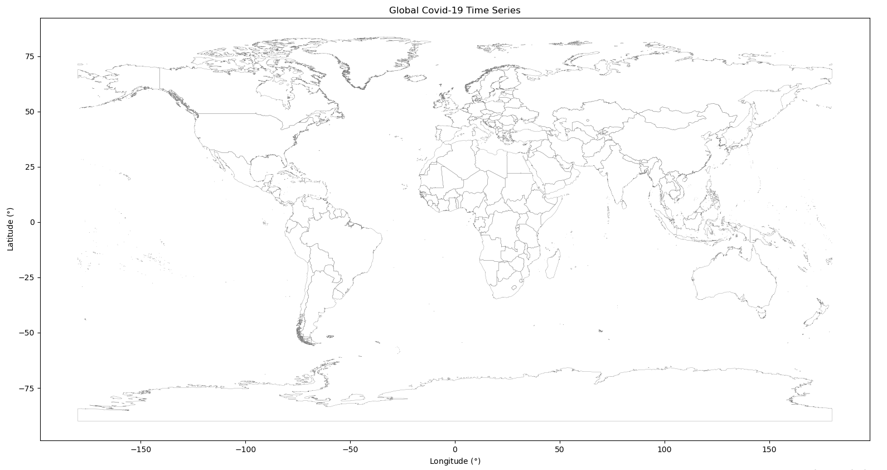

# Covid-19 Time Series

We retrieve data regarding global Covid-19 confirmed, death and recovered cases (provided by [JHU CSSE](https://github.com/CSSEGISandData/COVID-19)), clean it to our liking and then perform some analysis and visualisations.

By plotting US confirmed daily cases on a semi logarithmic plot, we can see that there was a short period of exponentional growth from about 2nd March to 22nd March, which is when stay-at-orders were beggining to be anounced. It seems that the lockdown procedures were successful in significantly reducing tranmission numbers.

By plotting the daily cases for each country/ province, overlayed on a world map, we get a nice visulation of how the pandemic started and spread across the globe.

