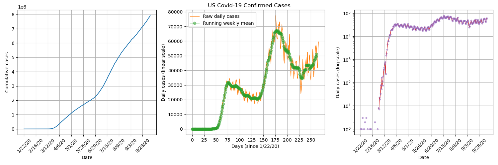
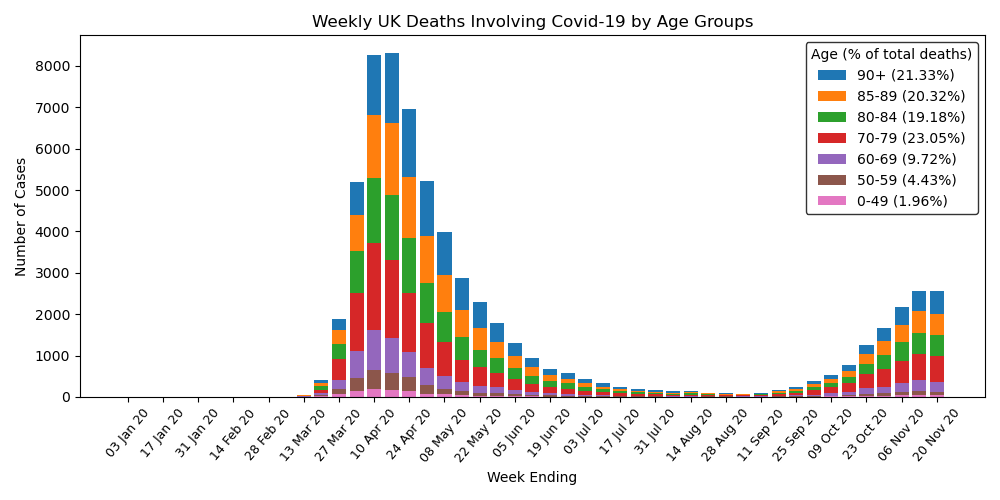
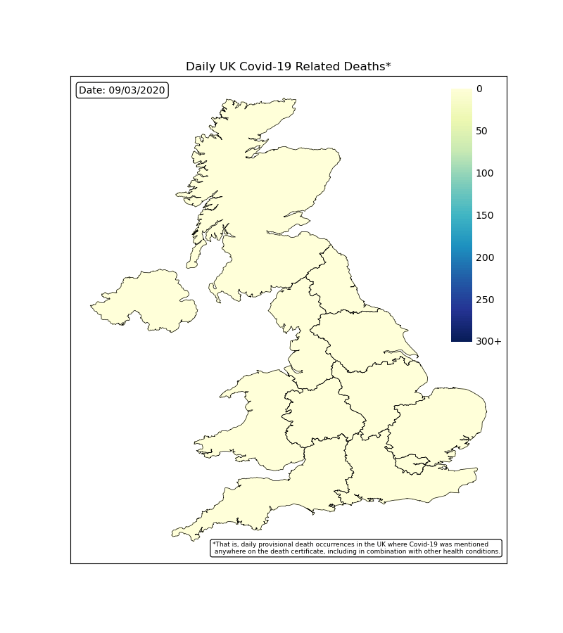

# Covid-19 Time Series

We retrieve Covid-19 data including global confirmed, death and recovered cases ([JHU CSSE](https://github.com/CSSEGISandData/COVID-19)) and UK deaths by age and region ([ONS](https://www.ons.gov.uk/peoplepopulationandcommunity/birthsdeathsandmarriages/deaths/datasets/weeklyprovisionalfiguresondeathsregisteredinenglandandwales)), clean it to our liking and then perform some analysis and visualisations.

# US Confirmed Daily Cases
By plotting US confirmed daily cases on a semi logarithmic plot, we can see that there was a short period of exponentional growth from about 2nd March to 22nd March, which is when stay-at-orders were beggining to be anounced in the US. It seems that the lockdown procedures were successful in significantly reducing tranmission numbers.

# Global Confirmed Daily Cases
By plotting the daily confirmed cases for each country/ province, overlayed on a world map, we get a nice visulation of how the pandemic spread across the globe. We can see that it starts in Wuhan, China and then isolated hotspots appears thoughout the rest of the world which gradually grow.

# UK Deaths by Age

# UK Deaths by Region

